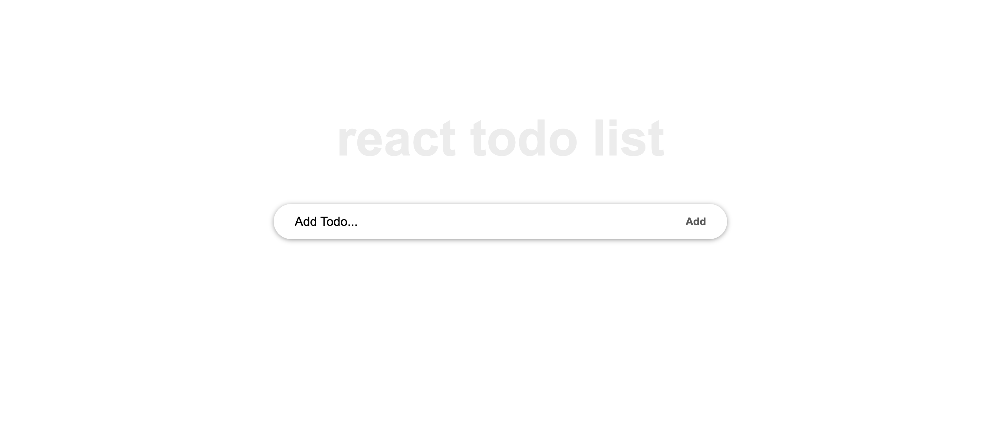
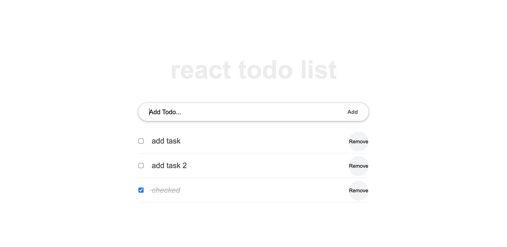

# React TODOList App

To do list is a simple Application to schedule tasks, we build this awesome product with plaint ReactJS, this is what makes it more powerfully.

# Web presentation

> || Home page|| Add todo|| 
> |-|---------|-|--------||
> ||  ||  ||

## Live Demo

[See Demo]()


Additional description about the project and its features.

## Built With

- Major language (React)

- # Technologies used
    - ReactJS
    - CSS

## Getting Started

To get a local copy up and running follow these simple example steps.

### Prerequisites
 - A text editor(preferably Visual Studio Code)

### Usage
#### Clone this repository

```bash
$ git clone https://github.com/joskalenda/react-todoList.git
$ cd react-todoList
```
## Available Scripts

In the project directory, you can run:

```bash
$ npm start #to start the webapp
$ npm test #to run the testing 
$ npm run build #to build the webapp
```

## Authors

👤 **Jos Kalenda**

- GitHub: [JosKalenda](https://github.com/joskalenda)
- LinkedIn: [JosKalenda](https://linkedin.com/in/joskalenda)

## 🤝 Contributing

Contributions, issues, and feature requests are welcome!

Feel free to check the [issues page](https://github.com/joskalenda/math-magicians/issues).

## Show your support

Give a ⭐️ if you like this project!

## 📝 License

This project is [MIT](https://opensource.org/licenses/MIT) licensed.